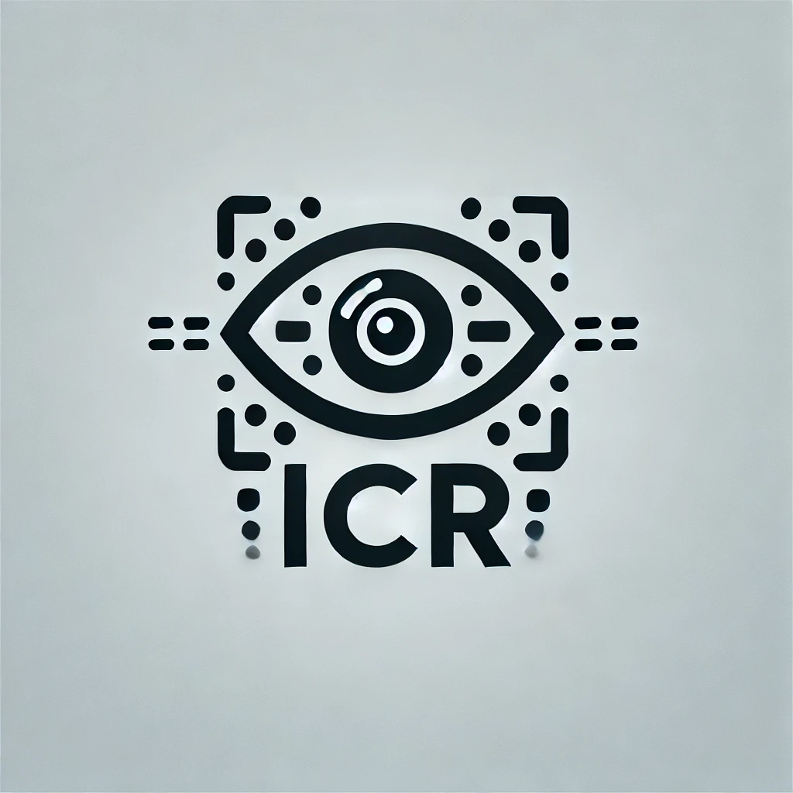
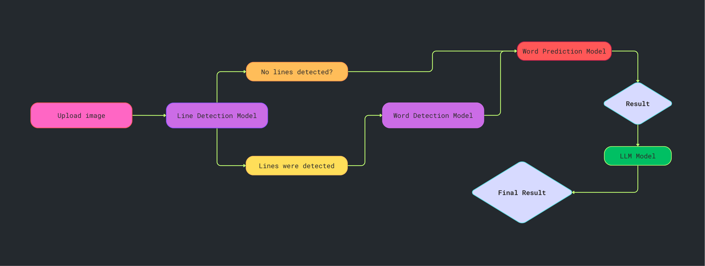

<a name="readme-top"></a>

# [Intelligent Character Recognition](https://icr-handwriting.streamlit.app/)

<div align="center">
  
  <h1> Handwriting Recognition </h1>
</div>

<details open>
<summary>Table of Contents</summary>
<ol>
  <li>
    <a href="#introduction">Introduction</a>
  </li>
  <li>
    <a href="#features">Features</a>
    <ul>
      <li>
        <a href="#built-with">Built With</a>
      </li>
    </ul>
  </li>
  <li>
    <a href="#getting-started">Getting Started</a>
    <ul>
      <li><a href="#prerequisites">Prerequisites</a></li>
      <li><a href="#setup">Setup</a></li>
    </ul>
  </li>
  <li><a href="#demo">Demo</a></li>
  <li><a href="#contributing">Contributing</a></li>
  <li><a href="#license">License</a></li>
</ol>
</details>

## Introduction
This is an Intelligent Character Recognition application. The goal of this project is to develop an accessible application that can decrypt various pieces of handwritten text. 

### Model Workflow
<div align="center">
  
</div>  
<p align="right"><a href="#readme-top">Back to top</a></p>


## Features
* **Image-Based Detection:** Deciphers handwritten and printed words
* **Streamlit Interface:** User-friendly web interface for interactivity.
* **Custom Training:** All models were fine-tuned on a labeled dataset for optimized accuracy.

### Built With 
[![Python][Python]][Python-url]
[![Numpy][Numpy]][Numpy-url]
[![OpenCV][OpenCV]][OpenCV-url]
[![Streamlit][Streamlit]][Streamlit-url]
[![Pillow][Pillow]][Pillow-url]
[![Google Gemini][Gemini]][Gemini-url]

<p align="right"><a href="#readme-top">Back to top</a></p>


## Getting Started
To get a local copy of this project up and running locally follow these steps:  

### Prerequisites
1. Make sure you have Python installed and use Python3 version 3.9
**NOTE:** You can check if Python is installed and its version with 
    ```sh
    python -V | python --version
    ```
2. Make sure you have Git installed  
**NOTE:** You can check if Python is installed and its version with
    ```sh
    git -v | git --version
    ```

### Setup
1. Navigate to original github repo [here](https://github.com/Dewiin/icr_capstone)
2. Navigate to the directory where you want to clone/run/save the application:
    ```sh
    cd example_directory
    ```
3. Clone the repository:
    ```sh
    git clone https://github.com/Dewiin/icr_capstone.git
    ```
4. Navigate to the project directory:
    ```sh
    cd icr_capstone
    ```
5. Create a Python virtual environment in the cloned project directory:
    ```sh
    python3.9 -m venv .icr_venv
    ```
6. Activate the virtual environment (Windows OR Mac/Linux):
    1. Windows
        ```sh
          .\.icr_venv\Scripts\activate
        ```
    2. Mac/Linux
        ```sh
          source .icr_venv/bin/activate
        ```
7. Install dependencies:
    ```sh
    pip install -r requirements.txt
    ```
8. Set up a Gemini API key:
    - Get your Gemini API key [here](https://ai.google.dev/gemini-api/docs/api-key)
    - Create a ``.streamlit`` folder.  
    Inside, create a ``secrets.toml`` file, and write:
        ```sh
        [secrets]
        GEMINI_API_KEY = "your-api-key"
        ```
    - Replace ``your-api-key`` with your Gemini API key (keep the quotations).

### Usage
1. Run the application:
    ```sh
    streamlit run app.py
    ```
2. Using the features:
    - Upload an image of text for the model to decipher.
    - Wait for your results, and you're done!

<p align="right"><a href="#readme-top">Back to top</a></p>

## Demo
Streamlit Web Application  

https://github.com/user-attachments/assets/1c4d7e99-aa36-4bc7-b9fe-6be9b2cc5b38


<p align="right"><a href="#readme-top">Back to top</a></p>

## Contributing
I like open-source and want to develop practical applications for real-world problems. However, individual strength is limited. So, any kind of contribution is welcome, such as:
- New features
- New models (your fine-tuned models)
- Bug fixes
- Typo fixes
- Suggestions
- Maintenance
- Documents
- etc

#### Heres how you can contribute:
1. Fork the repository
2. Create a new feature branch
3. Commit your changes 
4. Push to the branch 
5. Submit a pull request

<p align="right"><a href="#readme-top">Back to top</a></p>


## License
MIT License

Copyright (c) 2024 DTM

Permission is hereby granted, free of charge, to any person obtaining a copy
of this software and associated documentation files (the "Software"), to deal
in the Software without restriction, including without limitation the rights
to use, copy, modify, merge, publish, distribute, sublicense, and/or sell
copies of the Software, and to permit persons to whom the Software is
furnished to do so, subject to the following conditions:

The above copyright notice and this permission notice shall be included in all
copies or substantial portions of the Software.

THE SOFTWARE IS PROVIDED "AS IS", WITHOUT WARRANTY OF ANY KIND, EXPRESS OR
IMPLIED, INCLUDING BUT NOT LIMITED TO THE WARRANTIES OF MERCHANTABILITY,
FITNESS FOR A PARTICULAR PURPOSE AND NONINFRINGEMENT. IN NO EVENT SHALL THE
AUTHORS OR COPYRIGHT HOLDERS BE LIABLE FOR ANY CLAIM, DAMAGES OR OTHER
LIABILITY, WHETHER IN AN ACTION OF CONTRACT, TORT OR OTHERWISE, ARISING FROM,
OUT OF OR IN CONNECTION WITH THE SOFTWARE OR THE USE OR OTHER DEALINGS IN THE
SOFTWARE.


[Python]: https://img.shields.io/badge/python-FFDE57?style=for-the-badge&logo=python&logoColor=4584B6
[Python-url]: https://www.python.org/

[Numpy]: https://img.shields.io/badge/numpy-%23013243.svg?style=for-the-badge&logo=numpy&logoColor=white
[Numpy-url]: https://numpy.org/

[OpenCV]: https://img.shields.io/badge/opencv-000000?style=for-the-badge&logo=opencv&logoColor=00ff00
[OpenCV-url]: https://opencv.org/

[Streamlit]: https://img.shields.io/badge/streamlit-ffffff?style=for-the-badge&logo=streamlit&logoColor=ff0000
[Streamlit-url]: https://streamlit.io/

[Pillow]: https://img.shields.io/badge/pillow-000000?style=for-the-badge&logo=pillow
[Pillow-url]: https://pillow.readthedocs.io/en/stable/

[Gemini]: https://img.shields.io/badge/Google%20Gemini-886FBF?style=for-the-badge&logo=googlegemini&logoColor=fff
[Gemini-url]: https://gemini.google.com/app
